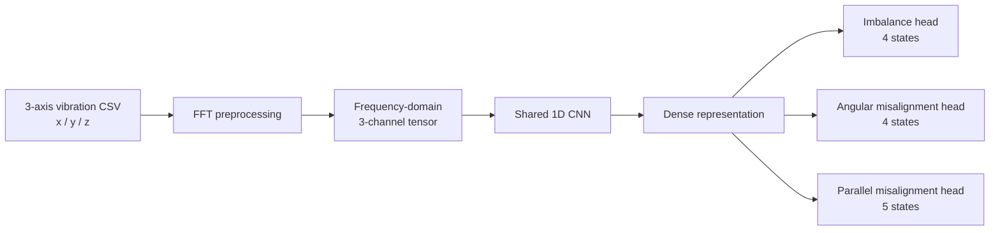

# Smart Maintenance — Multi-Task Motor Fault Diagnosis

[](https://www.python.org/)
[](https://www.tensorflow.org/)
[](https://jupyter.org/)


[](LICENSE)

A predictive-maintenance research project for diagnosing rotating-machine faults from **three-axis vibration signals**. The notebook transforms time-domain sensor data into frequency-domain features and trains a **multi-task 1D CNN** to identify multiple fault dimensions in a shared model.

## Problem

Rotating equipment can exhibit more than one fault condition at the same time. Treating every combination as a completely independent class wastes structure in the problem.

This project decomposes the diagnosis into related tasks and learns them jointly:

- **UB / UP** — imbalance state;
- **MA** — angular misalignment state;
- **MP** — parallel misalignment state.

The original label set also contains combined fault cases, making multi-task learning a natural way to share signal representations while producing separate diagnostic outputs.

## End-to-end pipeline



## Signal processing

The notebook reads three-axis vibration data and applies a real-valued FFT. The original experiment uses a sampling-rate constant of **51,200 Hz** and constructs frequency-domain representations for the X, Y, and Z channels.

## Multi-task label design

The notebook defines three output spaces:

| Task | States represented in code |
|---|---|
| Imbalance | no fault, UB_1P, UB_2P, UB_3P |
| Angular misalignment | no fault, MA_P16, MA_P20, MA_P46 |
| Parallel misalignment | no fault, MP_N13, MP_N16, MP_N18, MP_N24 |

The source label list also contains combined conditions such as `MA_P16+UB_1P`, allowing each training example to be decomposed into the corresponding task-specific targets.

## Model

The shared network uses stacked Conv1D blocks followed by dense layers. Three softmax heads are trained jointly:

```text
Shared Conv1D feature extractor
        │
        ▼
Dense 128 → Dense 128 → Dense 64
        ├── Imbalance softmax (4)
        ├── Angular misalignment softmax (4)
        └── Parallel misalignment softmax (5)
```

The model is compiled with categorical cross-entropy and accuracy metrics, with checkpointing and early stopping in the training workflow.

## Repository structure

```text
.
├── SmartMaintainence_Model.ipynb   # Preprocessing, multi-task model, training and test inference
├── LICENSE                         # CC0 1.0
├── .gitignore
├── .gitattributes
└── README.md
```

## Data expectations

The notebook expects vibration CSV files from the original experiment, including training groups and test data. These datasets are **not included** in the repository.

Typical dependencies:

```text
tensorflow
numpy
scipy
pandas
matplotlib
tqdm
```

Open [`SmartMaintainence_Model.ipynb`](SmartMaintainence_Model.ipynb), update the local paths, and run the preprocessing/training sections in sequence.

## Evaluation status

The repository preserves model-building and training code but does not currently expose a clean final benchmark report. No unsupported accuracy claim is made here.

For maintenance use cases, evaluation should go beyond overall accuracy and include:

- per-fault precision, recall, and F1;
- confusion matrices for each output head;
- performance under different load/speed conditions;
- false-negative analysis for safety-critical faults;
- robustness to sensor placement, noise, and domain shift.

## Why multi-task learning?

The faults share the same vibration source and feature extractor. A shared model can learn reusable signal patterns while preserving separate outputs for different fault dimensions. It also maps naturally to combined-fault cases without requiring every possible combination to become a completely unrelated class.

## Limitations

- Data files and trained weights are not included.
- Some paths in the notebook are machine-specific and must be changed.
- The FFT preprocessing includes experiment-specific assumptions and constants that should be validated for a new machine/sensor setup.
- Final metrics are not versioned in the repository.
- The current workflow is a research notebook, not an online condition-monitoring service.

## Production-oriented next steps

1. Formalize the signal schema and sensor metadata.
2. Add deterministic preprocessing tests.
3. Compare time-domain, frequency-domain, and time-frequency representations.
4. Add experiment tracking and cross-condition validation.
5. Calibrate fault probabilities and alert thresholds.
6. Package preprocessing + inference into a repeatable service.
7. Monitor data drift across machines and operating regimes.

## Skills demonstrated

Predictive maintenance · vibration analytics · FFT · time-series deep learning · multi-task learning · 1D CNN · TensorFlow/Keras · fault diagnosis

## License

This repository includes a [CC0 1.0 Universal](LICENSE) dedication. Any external dataset or equipment data may have separate usage terms.
